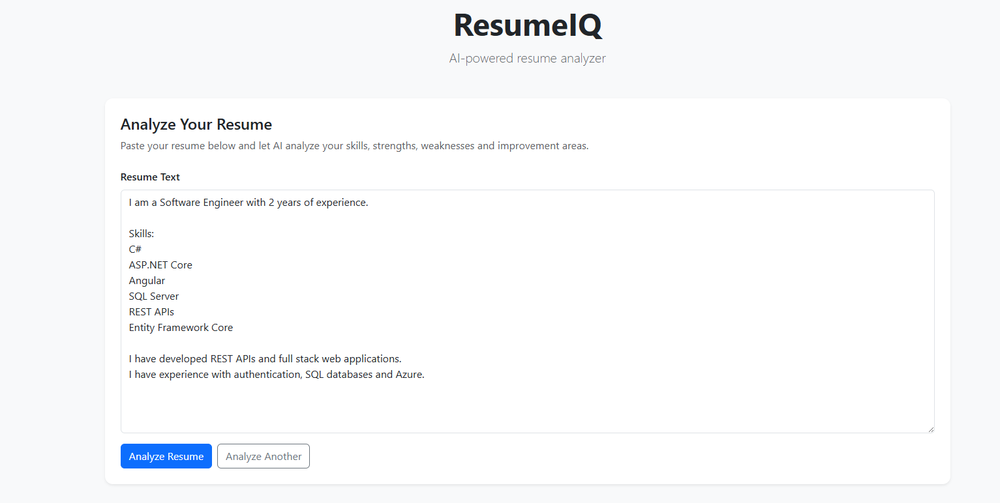
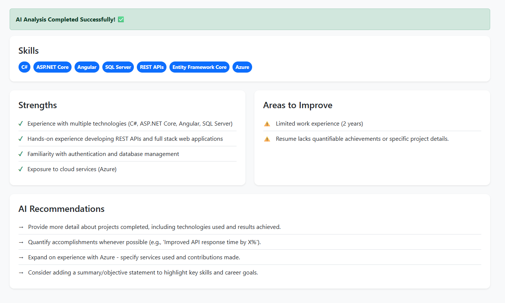
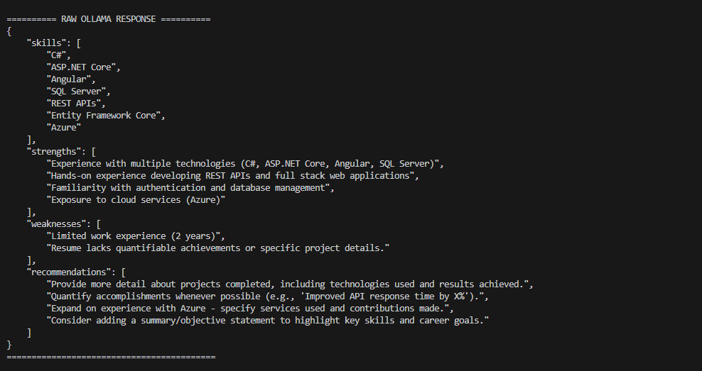

# 🚀 ResumeIQ — AI-Powered Resume Analyzer

ResumeIQ is a full-stack AI-powered resume analysis application built using **Angular**, **ASP.NET Core Web API**, and a locally hosted **Gemma 3 Large Language Model** using **Ollama**.

The application analyzes resume content and generates structured insights including:

- 🛠️ Technical skills
- 💪 Strengths
- ⚠️ Areas for improvement
- 💡 AI-generated recommendations

The main goal of this project is to demonstrate how **AI/LLM capabilities can be integrated into a real-world full-stack application using completely free and locally hosted tools**.

---

## ✨ Features

- 🤖 AI-powered resume analysis
- 🧠 Local LLM inference using Gemma 3
- 🦙 Ollama integration
- 🔌 ASP.NET Core REST API
- 🅰️ Angular frontend
- 🎨 Bootstrap UI
- 🎯 SCSS styling
- 📦 Structured JSON AI responses
- 💉 Dependency Injection
- 🔄 HttpClientFactory
- 🧩 AI service abstraction using `IAiService`
- 📋 Automatic skill extraction
- 💪 Strength identification
- ⚠️ Weakness detection
- 💡 AI-generated recommendations
- 📖 Swagger/OpenAPI documentation
- 🔐 CORS configuration
- ⏳ Loading and error states
- 💰 Completely free and locally runnable

---

## 🎬 How It Works

The user enters their resume into the Angular application.

ResumeIQ then sends the resume to the ASP.NET Core backend.

The backend sends the resume to a locally running Ollama instance.

Ollama uses the Gemma 3 model to analyze the resume and return structured JSON.

The ASP.NET Core API converts the AI response into a strongly typed response model and sends it back to Angular.

Angular then displays the analysis in a clean dashboard.

```text
User
  │
  ▼
Angular Frontend
  │
  │ HTTP POST
  ▼
ASP.NET Core Web API
  │
  ▼
IAiService
  │
  ▼
OllamaAiService
  │
  │ HTTP
  ▼
Ollama
  │
  ▼
Gemma 3
  │
  │ Structured JSON
  ▼
ASP.NET Core
  │
  ▼
Angular
  │
  ▼
Analysis Dashboard
```

---

## 📸 Screenshots

### 📝 Resume Analyzer

The Angular frontend provides a simple interface where users can paste their resume and submit it for AI analysis.



---

### 🤖 AI Resume Analysis

After the analysis is completed, ResumeIQ displays detected skills, strengths, areas for improvement, and AI-generated recommendations.



---

### 🧠 Local Gemma 3 Response

The backend communicates with Ollama and receives a structured JSON response generated by Gemma 3.



---

## 🏗️ Architecture

```text
                         ┌──────────────────────┐
                         │        User          │
                         │      Browser         │
                         └──────────┬───────────┘
                                    │
                                    ▼
                         ┌──────────────────────┐
                         │   Angular Frontend   │
                         │   localhost:4200     │
                         └──────────┬───────────┘
                                    │
                              HTTP POST
                                    │
                                    ▼
                         ┌──────────────────────┐
                         │  ASP.NET Core API    │
                         │   localhost:5155     │
                         └──────────┬───────────┘
                                    │
                                    ▼
                         ┌──────────────────────┐
                         │   ResumeController   │
                         └──────────┬───────────┘
                                    │
                                    ▼
                         ┌──────────────────────┐
                         │      IAiService      │
                         │ Service Abstraction  │
                         └──────────┬───────────┘
                                    │
                                    ▼
                         ┌──────────────────────┐
                         │   OllamaAiService    │
                         └──────────┬───────────┘
                                    │
                                    │ HTTP
                                    ▼
                         ┌──────────────────────┐
                         │        Ollama        │
                         │   localhost:11434    │
                         └──────────┬───────────┘
                                    │
                                    ▼
                         ┌──────────────────────┐
                         │       Gemma 3        │
                         │      Local LLM       │
                         └──────────┬───────────┘
                                    │
                              JSON Response
                                    │
                                    ▼
                         ┌──────────────────────┐
                         │ ResumeAnalysisResponse│
                         └──────────┬───────────┘
                                    │
                                    ▼
                         ┌──────────────────────┐
                         │   Angular Dashboard  │
                         └──────────────────────┘
```

---

## 🔄 End-to-End Request Flow

```text
1. User enters resume text
              │
              ▼
2. Angular captures resume
              │
              ▼
3. Angular sends POST /api/Resume/analyze
              │
              ▼
4. ASP.NET Core receives request
              │
              ▼
5. ResumeController calls IAiService
              │
              ▼
6. OllamaAiService creates AI prompt
              │
              ▼
7. ASP.NET Core sends request to Ollama
              │
              ▼
8. Ollama executes Gemma 3 locally
              │
              ▼
9. Gemma 3 analyzes resume
              │
              ▼
10. Ollama returns structured JSON
              │
              ▼
11. ASP.NET Core deserializes JSON
              │
              ▼
12. ResumeAnalysisResponse is returned
              │
              ▼
13. Angular receives response
              │
              ▼
14. Angular renders analysis dashboard
```

---

## 🛠️ Technology Stack

### Frontend

- Angular
- TypeScript
- Bootstrap
- SCSS
- RxJS
- Angular HttpClient
- Angular Signals

### Backend

- ASP.NET Core Web API
- C#
- .NET
- REST APIs
- Dependency Injection
- HttpClientFactory
- DTOs
- Swagger / OpenAPI
- CORS

### AI

- Ollama
- Gemma 3
- Local LLM inference
- Prompt Engineering
- Structured JSON generation

### Development Tools

- Visual Studio Code
- Git
- GitHub
- Swagger UI
- Ollama
- Node.js
- .NET SDK

---

## 📁 Project Structure

```text
ResumeIQ/
│
├── ResumeIQ.API/
│   │
│   ├── Controllers/
│   │   └── ResumeController.cs
│   │
│   ├── Models/
│   │   ├── ResumeAnalysisRequest.cs
│   │   └── ResumeAnalysisResponse.cs
│   │
│   ├── Services/
│   │   ├── IAiService.cs
│   │   └── OllamaAiService.cs
│   │
│   ├── Properties/
│   │   └── launchSettings.json
│   │
│   ├── Program.cs
│   ├── appsettings.json
│   └── ResumeIQ.API.csproj
│
├── resume-iq-ui/
│   │
│   ├── src/
│   │   └── app/
│   │       │
│   │       ├── core/
│   │       │   ├── models/
│   │       │   │   ├── resume-analysis.model.ts
│   │       │   │   └── resume-analysis-request.model.ts
│   │       │   │
│   │       │   └── services/
│   │       │       └── resume.service.ts
│   │       │
│   │       └── features/
│   │           └── resume-analyzer/
│   │               ├── resume-analyzer.ts
│   │               ├── resume-analyzer.html
│   │               └── resume-analyzer.scss
│   │
│   ├── angular.json
│   ├── package.json
│   └── tsconfig.json
│
├── screenshots/
│   ├── resume-analyzer.png
│   ├── ai-analysis-results.png
│   └── ollama-response.png
│
└── README.md
```

---

## 🤖 AI Integration

ResumeIQ uses **Ollama** to run **Gemma 3 locally**.

No paid AI API is required.

The current AI architecture is:

```text
ASP.NET Core
      │
      │ HTTP POST
      ▼
Ollama API
      │
      ▼
Gemma 3
      │
      ▼
Structured JSON
      │
      ▼
ASP.NET Core
      │
      ▼
Angular
```

The AI inference happens locally on the developer's machine.

This makes the application:

- Free to develop
- Free from API usage costs
- Suitable for experimentation
- More privacy-friendly for local resume processing

---

## 🧠 AI Analysis

ResumeIQ currently analyzes four major areas.

### 🛠️ Skills

The AI identifies technical and professional skills from the resume.

Example:

```text
C#
ASP.NET Core
Angular
SQL Server
REST APIs
Entity Framework Core
Azure
```

### 💪 Strengths

The AI identifies areas where the resume demonstrates strong experience.

Example:

```text
Experience with REST APIs
Full-stack development
Backend development
Database management
Cloud exposure
```

### ⚠️ Weaknesses

The AI identifies missing information or areas that could be improved.

Example:

```text
Limited project metrics
Missing quantifiable achievements
Insufficient project details
```

### 💡 Recommendations

The AI generates suggestions to improve the resume.

Example:

```text
Add measurable achievements
Provide project details
Describe technical contributions
Highlight project impact
```

---

## 🔌 API

### Analyze Resume

```http
POST /api/Resume/analyze
```

### Request

```json
{
  "resumeText": "I have experience developing REST APIs using ASP.NET Core, Angular and SQL Server."
}
```

### Response

```json
{
  "skills": [
    "ASP.NET Core",
    "Angular",
    "SQL Server",
    "REST APIs"
  ],
  "strengths": [
    "Backend development",
    "Full-stack development"
  ],
  "weaknesses": [
    "Limited information about project achievements"
  ],
  "recommendations": [
    "Add measurable achievements to projects",
    "Provide more information about project complexity"
  ]
}
```

---

## 🧩 Backend Design

The AI functionality is abstracted behind an `IAiService` interface.

```text
ResumeController
       │
       ▼
   IAiService
       │
       ▼
OllamaAiService
       │
       ▼
     Ollama
       │
       ▼
    Gemma 3
```

The controller does not directly depend on the Ollama implementation.

Instead, it depends on the abstraction:

```csharp
IAiService
```

This provides loose coupling and makes the AI implementation replaceable.

For example, future implementations could be:

```text
IAiService
   │
   ├── OllamaAiService
   │
   ├── LocalAiService
   │
   └── FutureAiService
```

---

## 💉 Dependency Injection

The application uses ASP.NET Core's built-in Dependency Injection system.

The AI service is registered through the application startup configuration.

The controller receives the abstraction rather than creating the service manually.

This follows the Dependency Inversion Principle and makes the application easier to test and maintain.

---

## 🌐 HttpClientFactory

The backend communicates with Ollama through an HTTP client.

Instead of manually creating `HttpClient` instances, the application uses ASP.NET Core's `HttpClientFactory` infrastructure.

This provides:

- Centralized HTTP client configuration
- Dependency Injection
- Better connection management
- Testability
- Cleaner service implementation

---

## 📦 Strongly Typed AI Response

The AI response is converted into a strongly typed C# response model.

The structure contains:

```text
ResumeAnalysisResponse
│
├── Skills
├── Strengths
├── Weaknesses
└── Recommendations
```

This provides a defined contract between:

```text
AI
 ↓
ASP.NET Core
 ↓
Angular
```

The Angular application also uses a TypeScript interface representing the same response structure.

---

## 🧠 Prompt Engineering

The AI service sends a structured prompt to Gemma 3.

The prompt instructs the model to analyze:

1. Skills
2. Strengths
3. Weaknesses
4. Recommendations

The model is also instructed to return structured JSON.

This allows the backend to deserialize the AI response instead of treating it as unstructured text.

The application therefore follows:

```text
Resume Text
     │
     ▼
Prompt
     │
     ▼
Gemma 3
     │
     ▼
JSON
     │
     ▼
C# Object
     │
     ▼
Angular Model
     │
     ▼
UI
```

---

## 🦙 Ollama Setup

Install Ollama from:

https://ollama.com/

Verify installation:

```bash
ollama --version
```

Pull Gemma 3:

```bash
ollama pull gemma3
```

Check installed models:

```bash
ollama list
```

Run Gemma 3 manually:

```bash
ollama run gemma3
```

Ollama exposes its local API at:

```text
http://localhost:11434
```

---

## ⚙️ Ollama Configuration

The backend uses the Ollama local endpoint and Gemma 3 model.

Example configuration:

```json
{
  "Ollama": {
    "BaseUrl": "http://localhost:11434",
    "Model": "gemma3"
  }
}
```

---

## 💻 Prerequisites

Before running the project, install:

- .NET SDK
- Node.js
- Angular CLI
- Ollama
- Git

Verify .NET:

```bash
dotnet --version
```

Verify Node:

```bash
node --version
```

Verify Angular:

```bash
ng version
```

Verify Ollama:

```bash
ollama --version
```

---

## ▶️ Run the Backend

Open a terminal and navigate to the backend:

```bash
cd ResumeIQ.API
```

Restore packages:

```bash
dotnet restore
```

Build:

```bash
dotnet build
```

Run:

```bash
dotnet run
```

The API will run on the configured local development port.

For the current development configuration:

```text
http://localhost:5155
```

---

## 📖 Swagger

Once the backend is running, open:

```text
http://localhost:5155/swagger
```

The Swagger interface allows the API to be tested without the Angular frontend.

Use:

```text
POST /api/Resume/analyze
```

---

## 🅰️ Run the Angular Frontend

Open another terminal.

Navigate to the frontend:

```bash
cd resume-iq-ui
```

Install dependencies:

```bash
npm install
```

Start Angular:

```bash
ng serve
```

Open:

```text
http://localhost:4200
```

The Resume Analyzer page is available at:

```text
http://localhost:4200/analyze
```

---

## 🔐 CORS

The Angular frontend and ASP.NET Core backend run on different local ports.

```text
Angular
http://localhost:4200

        │
        │ CORS
        ▼

ASP.NET Core
http://localhost:5155
```

The backend allows the Angular development origin through CORS.

---

## ⏳ Loading State

The Angular application maintains a loading state while Gemma 3 processes the resume.

```text
User clicks Analyze
        │
        ▼
isLoading = true
        │
        ▼
Analyze Resume
        │
        ▼
AI processing
        │
        ▼
Response received
        │
        ▼
isLoading = false
        │
        ▼
Display results
```

Angular Signals are used to maintain reactive UI state.

---

## ❌ Error Handling

The Angular frontend handles API errors and displays an appropriate error message to the user.

The backend also provides HTTP status information when API processing fails.

The application therefore handles:

- Empty resume input
- API failures
- AI service failures
- Invalid AI responses
- Network failures

---

## 💰 Cost

ResumeIQ is designed to run using free technologies.

| Technology | Cost |
|---|---|
| Angular | Free |
| ASP.NET Core | Free |
| Bootstrap | Free |
| Ollama | Free |
| Gemma 3 | Free / Local |
| Git | Free |
| GitHub | Free |

### AI Cost

```text
Paid AI API
     ❌

Azure
     ❌

OpenAI API
     ❌

Cloud AI service
     ❌

Ollama
     ✅

Gemma 3
     ✅

Local AI inference
     ✅
```

The current implementation does not require Azure or any paid AI service.

---

## 🚧 Current Project Status

### Version 1 — Completed

- [x] ASP.NET Core Web API
- [x] Angular frontend
- [x] Bootstrap UI
- [x] SCSS styling
- [x] Ollama integration
- [x] Gemma 3 integration
- [x] AI resume analysis
- [x] Structured JSON response
- [x] AI service abstraction
- [x] Dependency Injection
- [x] HttpClientFactory
- [x] Swagger/OpenAPI
- [x] CORS configuration
- [x] Angular to ASP.NET Core integration
- [x] ASP.NET Core to Ollama integration
- [x] AI-generated skills
- [x] AI-generated strengths
- [x] AI-generated weaknesses
- [x] AI-generated recommendations
- [x] Loading state
- [x] Error handling
- [x] Responsive analysis dashboard
- [x] Angular Signals
- [x] Structured result rendering

---

# 🔮 Future Roadmap

## Phase 2 — Resume File Upload

Currently the application works with pasted resume text.

The next step is supporting:

- [ ] PDF upload
- [ ] DOCX upload
- [ ] PDF text extraction
- [ ] DOCX text extraction
- [ ] File validation
- [ ] File size validation
- [ ] Resume preview

Planned flow:

```text
PDF / DOCX
     │
     ▼
ASP.NET Core
     │
     ▼
Text Extraction
     │
     ▼
Resume Text
     │
     ▼
Gemma 3
     │
     ▼
Resume Analysis
```

---

## Phase 3 — Database

Add a lightweight local database such as SQLite.

Planned technologies:

- Entity Framework Core
- SQLite
- Repository/service patterns

Planned functionality:

- [ ] Store resumes
- [ ] Store analysis results
- [ ] Analysis history
- [ ] User resume history
- [ ] Delete previous analyses

Architecture:

```text
Angular
   │
   ▼
ASP.NET Core
   │
   ▼
Entity Framework Core
   │
   ▼
SQLite
```

---

## Phase 4 — Job Description Matching

Allow users to provide a job description along with their resume.

```text
Resume
   +
Job Description
   │
   ▼
ResumeIQ
   │
   ▼
Job Match Analysis
```

Potential functionality:

- [ ] Skill matching
- [ ] Missing skill detection
- [ ] Keyword matching
- [ ] Job compatibility score
- [ ] Required skill detection
- [ ] Recommended skills
- [ ] Resume improvement suggestions

---

## Phase 5 — Resume Scoring

Introduce a deterministic resume scoring engine.

Instead of relying completely on the LLM, ResumeIQ can combine:

```text
               Resume
                  │
        ┌─────────┴─────────┐
        │                   │
        ▼                   ▼
Deterministic Engine    AI Engine
        │                   │
        │                 Gemma
        │                   │
        └─────────┬─────────┘
                  │
                  ▼
            Final Analysis
```

The deterministic engine can handle:

- Skill matching
- Keyword matching
- Section validation
- Required skill detection
- Numeric scoring

The AI can handle:

- Contextual analysis
- Resume quality
- Experience analysis
- Recommendations

---

## Phase 6 — Authentication

Add user authentication.

Potential technologies:

- JWT
- ASP.NET Core Authentication
- Angular Route Guards
- Angular HTTP Interceptor

Planned functionality:

- [ ] Registration
- [ ] Login
- [ ] JWT authentication
- [ ] Password hashing
- [ ] Protected APIs
- [ ] User-specific resume history

Architecture:

```text
Angular
   │
   ▼
Login
   │
   ▼
ASP.NET Core
   │
   ▼
JWT
   │
   ▼
Protected APIs
```

---

## Phase 7 — Advanced AI

Future AI improvements could include:

- [ ] Embeddings
- [ ] Semantic skill matching
- [ ] Vector similarity
- [ ] Local vector database
- [ ] Retrieval-Augmented Generation
- [ ] RAG
- [ ] Context-aware recommendations
- [ ] Prompt versioning
- [ ] AI response evaluation

Potential architecture:

```text
Resume
   │
   ▼
Text Processing
   │
   ▼
Embeddings
   │
   ▼
Vector Database
   │
   ▼
Semantic Search
   │
   ▼
RAG
   │
   ▼
Gemma 3
   │
   ▼
Context-Aware Analysis
```

---

## Phase 8 — Production Engineering

Future backend improvements:

- [ ] Global exception handling
- [ ] Structured logging
- [ ] Request validation
- [ ] Rate limiting
- [ ] Caching
- [ ] Unit testing
- [ ] Integration testing
- [ ] API performance optimization
- [ ] Docker
- [ ] CI/CD
- [ ] Health checks
- [ ] API versioning

---

# 🎯 Learning Objectives

This project is designed to provide practical experience in both **full-stack development and AI integration**.

## ASP.NET Core

- REST API development
- Controllers
- Dependency Injection
- Service abstraction
- HttpClientFactory
- DTOs
- Configuration
- CORS
- Swagger
- JSON serialization/deserialization
- Error handling

## Angular

- Standalone components
- TypeScript
- Angular Signals
- Angular HttpClient
- RxJS
- Dependency Injection
- Component architecture
- Two-way binding
- Loading state
- Error state
- Bootstrap
- SCSS

## AI

- Local LLM integration
- Ollama
- Gemma 3
- Prompt engineering
- Structured AI output
- JSON response processing
- LLM service abstraction
- Local inference

## Future AI Concepts

- Embeddings
- Semantic search
- Vector databases
- RAG
- Prompt optimization
- AI evaluation

---

# 🧠 Why This Project Is Useful

ResumeIQ is intentionally designed as a relatively small project while still demonstrating several concepts that are useful in real-world software engineering.

Instead of building a very large application, the project focuses on a complete end-to-end workflow:

```text
Frontend
   ↓
REST API
   ↓
Service Layer
   ↓
External/Local AI Runtime
   ↓
LLM
   ↓
Structured Response
   ↓
Frontend Rendering
```

This makes it suitable for:

- Portfolio demonstration
- ASP.NET Core practice
- Angular practice
- AI integration learning
- System design discussions
- Full-stack interview preparation

---

# 🚀 Future Vision

The long-term goal is to evolve ResumeIQ from a basic resume analyzer into a complete **AI-powered Resume Intelligence Platform**.

The planned evolution is:

```text
Resume Analyzer
       │
       ▼
Resume File Processing
       │
       ▼
Resume Scoring
       │
       ▼
Job Description Matching
       │
       ▼
Semantic Skill Matching
       │
       ▼
Embeddings
       │
       ▼
Vector Search
       │
       ▼
RAG
       │
       ▼
AI Resume Intelligence
```

The project intentionally starts small and can gradually introduce advanced concepts without making the initial application unnecessarily complex.

---

# 👨‍💻 Author

**Tapan Ray**

Software Engineer

**Primary Technologies:**

- C#
- ASP.NET Core
- Angular
- SQL Server
- REST APIs
- Azure
- AI / LLM Integration

---

# 📄 License

This project is created for educational, learning, portfolio, and demonstration purposes.

---

## ⭐ ResumeIQ

Built with:

**Angular + ASP.NET Core + Ollama + Gemma 3**

A free, locally hosted AI-powered resume analysis application.
